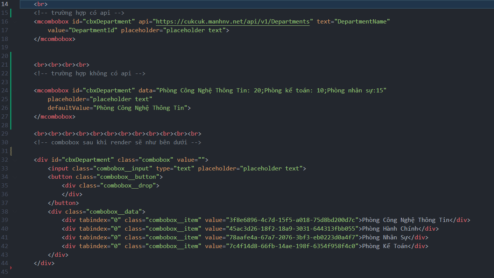

## Thư viện tạo combobox từ component đơn giản
Code sẽ được viết trong cặp thẻ 
```html
<mcombobox></mcombobox>
```
Trong đó :
- id: tên id của combobox muốn đặt
- api: địa chỉ api của trang web fetch data về
- text : giá trị của trường muốn lấy trong json trả về để gán vào textContent item
- value: giá trị của trường muốn lấy để gán vào value của item

````html
Thêm cặp thẻ sau vào đầu trang html để hiện được css mặc định của combobox
<link rel="stylesheet" href="css/combobox.css">

Thêm cặp thẻ sau vào cuối trang html để chạy được thư viện
<!-- script jquery -->
<script src="./js/jquery-3.6.1.min.js"></script>
<!-- script combobox -->
<script type="module" src="./js/combobox.js"></script>
````
